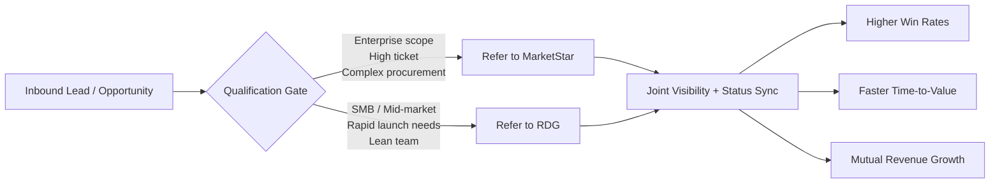

# MarketStar × Real Deal Growth (RDG)
## Co-Branded Partnership Pitch Deck (Partner-First Narrative)

> **Instruction acknowledged:** **build final polished file using this version**

---

## Slide 1 — Title
**MarketStar + RDG**  
### A Partner-First Referral Alliance that Expands Coverage, Protects Brand Equity, and Increases Win Rate

- Subtitle: **Enterprise Precision + SMB/Mid-Market Velocity**
- Presented to: **MarketStar Business Development Team**
- Date: **May 2026**

**Design notes**
- Left: MarketStar logo. Right: RDG logo. Center lockup: “×”.
- Background: subtle gradient with both brand colors at 10–15% opacity.
- Footer: confidentiality statement.

**Talk track**
“Today is about a simple idea: when each partner leads with what they do best, both companies win more deals, faster, with higher client satisfaction.”

---

## Slide 2 — Executive Summary (Partner-First)
### Why this partnership makes sense

1. **MarketStar wins first**: stronger conversion on right-fit enterprise opportunities and cleaner pipeline segmentation.
2. **RDG wins by design**: receives SMB/mid-market opportunities where speed and flexibility matter.
3. **Clients win always**: every lead is routed to the best delivery model, not forced into one model.

**Core principle**
> **Best-fit referral, not lead dumping.**

**Talk track**
“This is not just a referral exchange—it’s a fit-based growth system that preserves trust with prospects and elevates both brands.”

---

## Slide 3 — Strategic Fit: Distinct Strengths, Shared Outcomes
### MarketStar and RDG are complementary, not competitive

| Category | MarketStar | RDG |
|---|---|---|
| Primary segment | Enterprise / Global programs | SMB + Mid-Market growth |
| Deal profile | Higher ticket, longer-cycle, multi-stakeholder | Leaner scope, faster deployment |
| Engagement model | Structured scale and governance | Agile execution and rapid iteration |
| Ideal motion | Complex transformation | Quick-growth acceleration |

**Bottom line**
- **Large, strategic, multi-market opportunities → MarketStar**
- **Smaller, velocity-driven opportunities → RDG**

**Talk track**
“We are intentionally defining clear swim lanes so referrals increase close rates instead of creating overlap.”

---

## Slide 4 — Partnership Logic Diagram (1-page visual)
### Right Lead. Right Partner. Right Outcome.

**Design notes**
- Replace node blocks with branded rounded cards.
- Use iconography: funnel (inbound), checklist (qualification), building (enterprise), rocket (growth), dashboard (visibility), trophy (win).

**Talk track**
“The routing model is simple and enforceable: qualify once, route with confidence, maintain shared visibility, and optimize outcomes quarterly.”

---

## Slide 5 — Referral Framework (Two-Way)
### How referrals work in practice

**MarketStar → RDG referral triggers**
- Budget or scope below enterprise threshold.
- Need for faster pilot / lighter deployment.
- Growth-stage buyer with limited internal ops support.

**RDG → MarketStar referral triggers**
- Multi-region enterprise expansion.
- Complex stakeholder environment / governance requirements.
- High ACV strategic transformation mandates.

**SLAs**
- Intro acceptance: **within 1 business day**
- Discovery handoff completed: **within 3 business days**
- Referral status update cadence: **weekly**

**Talk track**
“This protects speed and accountability. Every referred lead receives a fast response and transparent progression.”

---

## Slide 6 — Value to MarketStar (Lead with Partner Benefit)
### Why MarketStar should do this

- **Protect enterprise focus** while still serving non-core inbound professionally.
- **Increase total monetization** of broader demand universe.
- **Improve partner trust** through high-integrity routing.
- **Create downstream expansion paths** where RDG-grown accounts can mature into MarketStar-scale engagements.

**Outcome statement**
> RDG acts as a trusted extension that captures value MarketStar might otherwise decline.

**Talk track**
“RDG is not a detour from MarketStar’s strategy—it is a force multiplier for it.”

---

## Slide 7 — Value to RDG (Aligned, Not Symmetric)
### Why RDG commits fully

- Access to right-fit SMB/mid-market opportunities.
- Better predictability through structured referral motion.
- Ability to refer up-market accounts to MarketStar without channel friction.
- Shared credibility from co-branded go-to-market narrative.

**Talk track**
“RDG receives quality pipeline, but just as importantly, we gain a trusted enterprise counterpart for larger opportunities.”

---

## Slide 8 — Joint Go-To-Market Plan
### 90-Day activation roadmap

**Phase 1 (Days 0–30): Foundation**
- Finalize ICP boundaries and referral criteria.
- Build referral intake form + qualification checklist.
- Launch shared reporting dashboard.

**Phase 2 (Days 31–60): Pilot**
- Run first 10–20 live referrals bi-directionally.
- Weekly deal desk + feedback loops.
- Refine scoring thresholds.

**Phase 3 (Days 61–90): Scale**
- Publish co-branded case stories.
- Expand to regional BD teams.
- Establish quarterly business review cadence.

**Talk track**
“We start narrow, instrument everything, then scale what proves conversion and client satisfaction.”

---

## Slide 9 — Governance + Measurement
### Success metrics both teams can trust

**Pipeline metrics**
- # referrals sent / accepted (by direction)
- Qualified conversion rate
- Avg. sales cycle by segment

**Revenue metrics**
- Closed-won value from partner referrals
- Influenced revenue
- Expansion revenue from graduated accounts

**Operational metrics**
- SLA adherence
- Time-to-first-meeting
- Partner NPS (quarterly)

**Talk track**
“If we can’t measure it, we can’t scale it. Governance is lightweight but rigorous.”

---

## Slide 10 — Co-Brand Execution Standards
### Presentation and asset quality bar

- Real logos with clear-space and color-safe lockups.
- Consistent icon family (outline or duotone, not mixed).
- 12-column grid for perfect alignment and spacing rhythm.
- Visual hierarchy: 1 message per slide, max 3 emphasis points.
- Diagrams as vector shapes, not plain text blocks.

**Talk track**
“Our co-branded market presence should look as disciplined as our operating model.”

---

## Slide 11 — Risks & Mitigations
### Anticipating friction before scale

- **Risk:** Lead ownership ambiguity  
  **Mitigation:** documented routing rules + CRM source tags.
- **Risk:** Slow follow-up on referrals  
  **Mitigation:** SLA clock + escalation owner.
- **Risk:** Perceived channel conflict  
  **Mitigation:** quarterly boundary review and exceptions panel.

**Talk track**
“We de-risk upfront so both teams can move confidently.”

---

## Slide 12 — Decision & Next Steps
### Proposed decision today

- Approve **60-day pilot launch**.
- Assign **1 BD owner per company** + 1 ops owner.
- Schedule **kickoff workshop** in next 7 business days.

**Close statement**
> MarketStar and RDG can jointly serve more of the market with higher integrity, better fit, and stronger revenue outcomes.

**Talk track**
“We are ready to activate immediately with clear owners, clear metrics, and a clear path to scale.”

---

## Appendix — Build Checklist for Final Designed Slides

- [ ] Replace placeholder logos with official SVG/PNG lockups.
- [ ] Apply brand palettes and typography tokens for both companies.
- [ ] Convert mermaid flow to native Slides vector diagram.
- [ ] Add icon set consistently across all section headers.
- [ ] Run alignment pass (grid + optical spacing).
- [ ] Export to PPTX + PDF for executive circulation.
